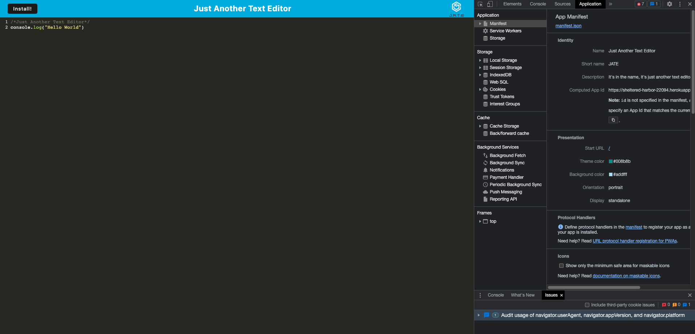
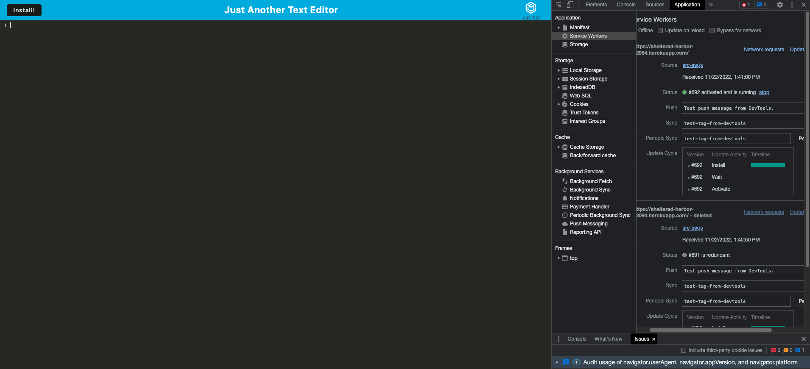

#Text Editor

##Table Of Contents
  *[Installation](#installation)
  *[Usage](#usage) 
  undefined
  *[Contributions](#contributions)
  *[Technologies Used](#technologies-used)
  *[Link](#link)
  *[Screenshots](#screenshots)
  *[Questions](#questions)

## Installation
    *Clone this repository
    *On the CLI run "npm i"
    *Run "npm start"
    *Once server is up and running, open a browser with the url (http://localhost:3000)

    Alternatively you could also just use the deployed heroku link below.

## Usage
    This application can be used within a browser. It's main function is for developers to create code with or without connection to the internet for future use.

    This application is covered by the following license: MIT.

## Contributions
    All people can contribute! 

## Technologies Used
    Express.js, Node.js, PWA, Webpack, IndexedDB

## Link
    This is the deployed link: https://sheltered-harbor-22094.herokuapp.com/

## Screenshots

## Questions
    If you have any questions, please contact me using the links below:
    Github: https://github.com/hghe95
    Email: hghe95@gmail.com